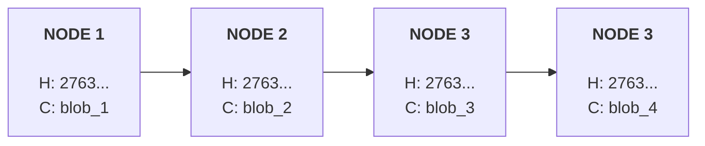

# Merkle DAG Implementation

## Overview

### What is it?

An implementation of a Merkle DAG, which is a data structure used in Gitalong to represent rooms and their trees.

You may think of it as the storage layer of Gitalong, providing a way to structure and persist data. Though an implementation of `gitalong-core-dag` can and is even encouraged to be Gitalong-agnostic.

### What does it do?

It can allow any caller to create and interact with new instances of a Merkle DAG, which in itself can hold multiple trees.

### How does it do it?

Though the technical details are up to the implementation, we will provide high-level SQL-like schemas as examples.

---

Our implementation focuses on structural integrity while allowing for data privacy. We will separate the "Skeleton" (Nodes) from the "Meat" (Blobs). This allows us to redact message content without breaking the cryptographic chain.

It needs to:
- Support multiple trees per instance, each identified by their respective root node's hash.
- Be *strictly* append-only (with the exception of redaction).
- Keep nodes (cryptographic relationship) and blobs (event contents) separate.
- Automatically perform verification of cryptographic integrity, among other things.

## Nodes & Blobs

We maintain two distinct things: **nodes and blobs**. The nodes are the trees. These will be the actual Merkle DAGs, an the immutable skeleton of the instances. Meanwhile, the blobs are the contents of events.

A node holds the following information:
- **hash**: The hash of the node itself.
- **parents**: The hashes of the parent nodes (remember: a node can have multiple parents).
- **content_ref**: The hash of the blob containing the event content.
- **context_ref**: An optional commitment to a specific node in the DAG. A valid use could define logical validity (what must be true for this node to exist). It can ensure that the node cannot be replayed or interpreted under a different set of rules without changing its identity. For example: we may want a message in a timeline to have a reference to a specific point in the state so that peers can know which rules applied when the message was sent.

A node may look like this:

| hash | parents |  |
|-|-|-|
| blob_1 | "{ 'type': 'm.text', 'body': 'I\'m the first message!' }" |  |

!!! note "Note on blob tables"
    The `blobs` table is a simple key-value store. It is not strictly append-only, but it is designed to be immutable. The `data` column is a CBOR object, while the `hash` column is a SHA256 hash of the `data` column, referenced by the nodes.
    
    There is actually no need for different blobs tables to be used for each instance, you may share a single blobs table across all instances. However, we currently keep a blob table for each instance.

!!! example

An instance's nodes may look like this:
    

And the blobs may look like this:
    
!!! warning inline end
    This isn't actually JSON, but CBOR! We are representing everything with JSON for the sake of simplicity.

| hash | data |
|-|-|
| blob_1 | "{ 'type': 'm.text', 'body': 'I\'m the first message!' }" |
| blob_2 | "{ 'type': 'm.text', 'body': 'I\'m the second message!' }" |
| blob_3 | "{ 'type': 'm.text', 'body': 'I\'m the third message!' }" |
| blob_4 | "{ 'type': 'm.text', 'body': 'I\'m the fourth message!' }" 
??? tip "SQL schema example"
    
    We maintain two distinct tables. The `nodes` table is the immutable skeleton of the chat, while the `blobs` table holds the potentially volatile message data.
    
    ### The `nodes` Table (The Ledger)
    This table is strictly **append-only**. It defines the sequence of events.
    
    | Key | Type | Description |
    |-|-|-|
    | **hash** | SHA256 (PK) | Primary key. A hash of `contents_ref + parent_keys[]` |
    | **contents_ref** | SHA256 (FK) | A hash and foreign key pointing to the `data` column in the `blobs` table, which is in itself a CBOR object. |
    | **context_ref** | SHA256 | Optional hash pointing to another node in the same instance. |
    
    ### The `edges` Table (The Relations)
    
    | Key | Type | Description |
    |-|-|-|
    | **node_hash** | SHA256 (FK) | The hash of the child node. |
    | **parent_hash** | SHA256 (FK) | The hash of the node being built upon. |
    
    ### The `blobs` Table (The Storage)
    This table stores the actual CBOR message bodies. To support redaction, rows in this table may be deleted.
    
    | Key | Type | Description |
    |-|-|-|
    | **hash** | SHA256 (PK) | The hash resulting from SHA256(data) |
    | **data** | CBOR | The data blob |

## Methods

### Create
`create() -> [Ok(dag_instance), Err(err)]`
Initializes a new MerkleDAG instance.

### Initialize
`initialize(dag_instance) -> [Ok(root_hash), Err()]`

#### Arguments
- **dag_instance**: A reference to the instance. Functions will be called here.

#### Returns
- **root_hash**: The root hash of the new tree. This will also act as the identifier for the new tree.

Initializes a new tree by creating its first node (e.g., for a new room). It generates a root `node` pointing to a room-initialization `blob`.

### Append
`append(parent_hashes, content, context_ref) -> [Ok(node_hash), Err(err)]`

Appends a new node as the child of a specified set of nodes.

0. **Validate**: All parents must exist, context_ref must point to a valid node if not null.
1.  **Hash Content**: Calculate `content_hash = SHA256(content_blob)`.
2.  **Store Data**: Save the blob into the `blobs` table using its hash as the primary key.
3.  **Link Node**: Calculate `node_hash = SHA256(parent_hashes + content_hash)`.
4.  **Commit**: Save the record to the `nodes` table.

#### Arguments
- **parent_hashes**: A list of hashes, defining the parents of the node that is going to be appended.
- **content**: The plaintext data that the node will be pointing to.
- **context_ref**: An optional reference to another node.

#### Returns

- **node_hash**: The hash of the new node.

!!! note "Note on salting"
    To prevent hash collisions and ensure privacy, all `content` payloads should include a sort of salt with random data. This ensures that they all result in unique hashes.

### Redact

`redact(content_hash) -> Ok()`

Deletes the entry in the `blobs` table. This "hollows out" the message. Any client crawling the `nodes` table will still see the message's place in history, but will find the content missing (returning `null`).

### Get
`get(node_hash) -> [Ok(Node + Blob), Err(err)]`
Retrieves the node and its associated blob. If the blob has been redacted, the implementation should return the node metadata with the data field set to `null`.

---

These are all of the methods that our Merkle tree needs in order to fulfill all of the requirements of Gitalong.

Not only is it simple, it would allow the implementation to have greater control unlike with Git.

It is imperative that the table remains append-only, still allowing nodes to be hollowed out through redactions.
